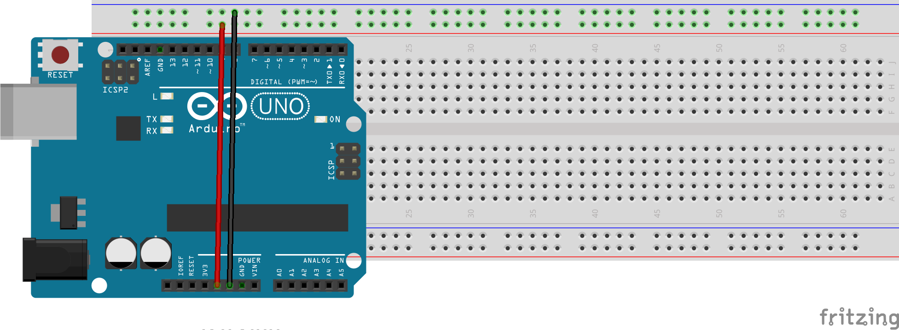
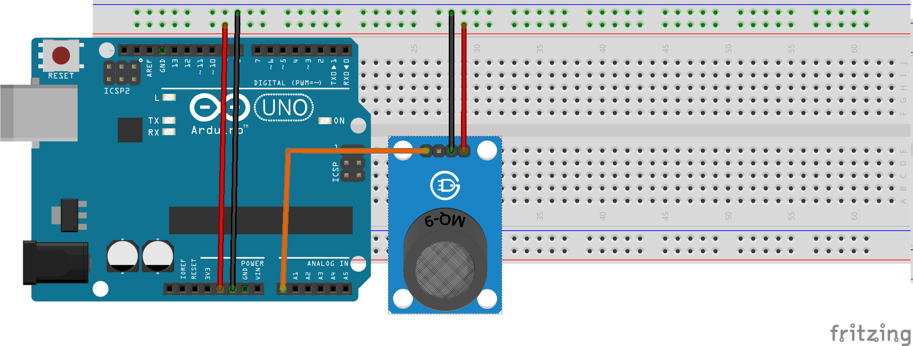
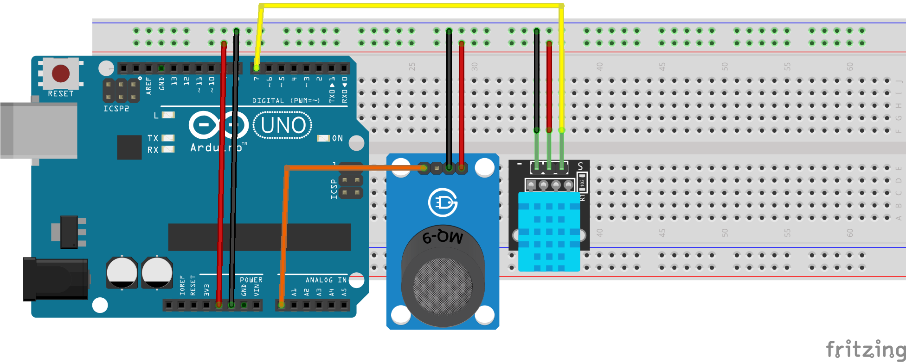
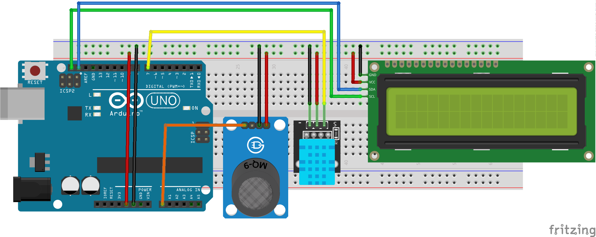

# Estación de calidad del aire

by @JAVacasm

## Montaje

### 1. Alimentación

#### Componentes
* Arduino (ordenador embebido, microcontrolador programable que controla al resto de componentes)
* Placa de prototipo (protoboard), que nos facilita el montaje sin soldura
* 2 cables macho-macho (a ser posibles negro y rojo)

#### Conexión

* 5V de Arduino a la pista roja de la protoboard (cable rojo)
* GND de Arduino (el que está al lado de 5V)  a la pista (cable negro)

### 2. Sensor de CO2 (MQ135)

#### Componentes
* Sensor de Gases, MQ135 Se utilizan en equipos de control de calidad del aire para edificios y oficinas, son adecuados para la detección de NH3, NOx, alcohol, benceno, humo, CO2, etc.
* 3 cables macho-macho

#### Conexión

* Vcc del sensor a la pista roja de la protoboard (cable rojo)
* GND del sensor   a la pista (cable negro)
* A0 del sensor conectado al A0 de Arduino

### 3. Sensor de temperatura y humedad (DHT22)

#### Componentes

* Sensor de temperatura y humedad DHT22 (el encapsulado puede ser blanco o azul)
* 3 cables macho-macho

#### Conexión

* \+ del sensor a la pista roja de la protoboard (cable rojo)
* \- del sensor  a la pista (cable negro)
* Out del sensor conectado al pin 7 de Arduino (cable amarillo)

### 4. LCD (pantalla de texto)

#### Componentes

* Pantalla LCD (Pantalla de visualización de caracteres, similar a las que encontramos en las máquinas expendedoras)
* 4 cables macho-hembra

#### Conexión

Conectamos el LCD

* Vcc del LCD a la pista roja de la protoboard (cable rojo)
* GND del LCD a la pista (cable negro)
* SDA del LCD a SDA de Arduino (junto al reset) (cable azul)
* SCL del LCD a SCL de Arduino (junto al reset) (cable verde)

## Programación

[Código](./CalidadAire/CalidadAire.ino)

* Conectamos con el cable USB al ordenador
* Abrimos el entorno Arduino
* Cargamos el Código
* Pulsamos el botón "Cargar a Arduino"

Podemos ver el histórico de datos con el Monitor Serie

En el código se usan las librerías
* LiquidCrystal i2C
* SimpleDHT
* MQ135

## Calibración

* Los sensores requieren entre 12 y 48 horas para estabilizar su medida
* Una vez pasado este tiempo tenemos que calibrar el sensor ajustando los valore s del código para obtener un valor comparable al de un sensor previamente calibrado
