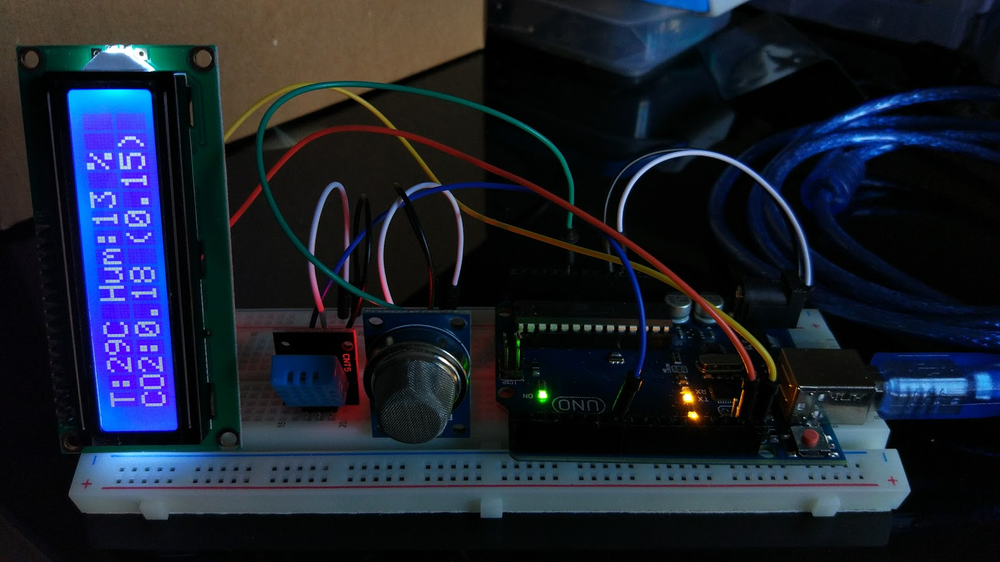
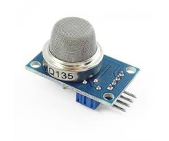
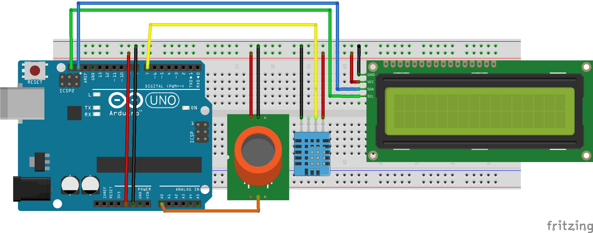

# Smart Cities: Estación medioambiental de bolsillo

## Parque de las Ciencias
## Ciencia de cerca

### by @JAVacasm

## Componentes

### Sensor de Gas MQ135

Estos sensores de gases son electroquímicos y varían su resistencia cuando se exponen a determinados gases, internamente posee un calentador encargado de aumentar la temperatura interna y con esto el sensor pueda reaccionar con los gases provocando un cambio en el valor de la resistencia.

Debido al calentador es necesario esperar un tiempo de calentamiento para que la salida sea estable y tenga las características que el fabricante muestra en sus datasheet, dicho tiempo dependiendo del modelo puede ser entre 12 y 48 horas.

Se utilizan en equipos de control de calidad del aire para edificios y oficinas, son adecuados para la detección de NH3, NOx, alcohol, benceno, humo, CO2, etc.

Este ultimo sensor es sensible en similar proporción a los gases mencionados, con lo que podemos determinar si el aire está limpio.

([Fuente](http://www.naylampmechatronics.com/blog/42_Tutorial-sensores-de-gas-MQ2-MQ3-MQ7-y-MQ13.html))

#### Valores medidos

* CO2 PPM (partes por millón)

* [TVOC (Valor total de compuestos orgánicos volátiles)](https://en.wikipedia.org/wiki/Volatile_organic_compound)

#### [Calibración](./calibracion.md)

### Sensor de temperatura y humedad (DHT11)

## [Montaje](./Montaje.md)

## [Código](./CalidadAire/CalidadAire.ino)

### Librerías

LiquidCrystal i2C
SimpleDHT
MQ135

### Referencias

#### Medida de calidad del Aire

[The Air Quality-Life Index (AQLI)](https://aqli.epic.uchicago.edu/)

#### Arduino

[Librerias para MQ135](https://drive.google.com/file/d/0B9TC96icExppb2o4RWNVakM1VUE/view)

[Cheap CO2 meter with MQ135](http://davidegironi.blogspot.com.es/2014/01/cheap-co2-meter-using-mq135-sensor-with.html#.WcIR9J8yqHv)

[Gas sensors for Arduino](https://playground.arduino.cc/Main/MQGasSensors)

[Tutorial: sensores de gas MQ2, MQ3, MQ7, MQ135](http://www.naylampmechatronics.com/blog/42_Tutorial-sensores-de-gas-MQ2-MQ3-MQ7-y-MQ13.html)

[CCS811: Air Quality sensor](https://learn.sparkfun.com/tutorials/ccs811-air-quality-breakout-hookup-guide?_ga=2.185296745.1703785601.1496370918-447672577.1492205268)

#### Proyectos

[CO-CO2 Sensor v.2](https://create.arduino.cc/projecthub/AndriMaker98/co-co2-sensor-v-2-ea6522?ref=search&ref_id=mq135&offset=1 )

[Wireless gas sensing](https://create.arduino.cc/projecthub/shuo-liu/walabot-for-wireless-gas-sensing-b1fff8?ref=search&ref_id=mq135&offset=3)

[Air Quality License Plate holder](https://create.arduino.cc/projecthub/air-defender/air-quality-license-plate-holder-cdb8a8)

[Air pollution monitoring](https://circuitdigest.com/microcontroller-projects/iot-air-pollution-monitoring-using-arduino)
