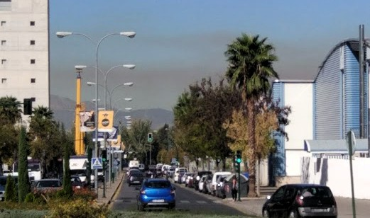

# Smart Cities: Estación medioambiental de bolsillo

## Parque de las Ciencias
## Ciencia de cerca

### by @JAVacasm

### https://goo.gl/td4nDs

### [25/10/2017 Madrid prohíbe aparcar de 9 a 20h ... ](http://www.20minutos.es/noticia/3168380/0/madrid-activara-manana-escenario-2-anticontaminacion-con-prohibicion-aparcar-ser-no-residentes/?utm_source=Twitter-20minutos&utm_medium=Social&utm_campaign=Postlink)

[Según la OMS: el 92% de la población mundial vive en lugares con una calidad del aire fuera de los parámetros recomendados](http://www.who.int/mediacentre/news/releases/2016/air-pollution-estimates/es/)

[Hay que luchar por descarbonizar la economía española](http://www.efeverde.com/noticias/descarbonizar-economia-espanola/)

[Unos 3 millones de muertes al año están relacionadas con la exposición a la contaminación de aire de exteriores](http://naukas.com/2017/10/24/por-que-necesitamos-energia-nuclear/)

## ¿Qué es una Smart City?

### En parte técnica:

* Redes de sensores: temperatura, ruido, calidad del aire
* Redes de actuadores: riego, iluminación, semáforos
* Redes
* Datos
* Procesamiento

### En parte humana:

* Comunidad, compartir (información, datos, conocimiento, experiencias)
* Masiva
* Comunicada

## Calidad del aire

[La EU tiene directivas a que obligan a que los datos de calidad](http://www.i-ambiente.es/?q=blogs/smart-cities-y-medio-ambiente-calidad-del-aire-i) del aire de nuestras ciudades sean públicos]

#### http://www.airqualitynow.eu/

¿Dependemos de lo que hagan nuestros políticos?

### ¿cómo podemos hacerlo

[Libelium](http://www.libelium.com/libeliumworld/smart_cities/)

#### Un caso real: radiación nuclear:Fukushima.

Los propios vecinos los que, alertados y desconfiados de los sistemas de información pública, decidieron compartir los datos de radiación que registraban sus dispositivos creando un mapa abierto de niveles de riesgo.

## ¿qué tipo de solución queremos?

## ¿Una caja negra cerrada?

# Recuperar el control de la tecnología
# Recuperar el control de los datos
# Ser creadores, no consumidores de tecnología

## [Solución](./Propuesta.md)

### Open Hardware

* Arduino
* Raspberry

### Open Software

* Códido abierto
* Linux

###  Open Data

* Transparencia
* Seguridad

¿De todo?

## Referencias

http://www.i-ambiente.es/?q=blogs/smart-cities-y-medio-ambiente-calidad-del-aire-i

[Smart Cities 2.0: El Reto de la Interoperabilidad para la democratización](https://www.esmartcity.es/comunicaciones/smart-cities-2-0-reto-interoperabilidad-democratizacion) https://www.esmartcity.es/comunicaciones/smart-cities-2-0-reto-interoperabilidad-democratizacion
